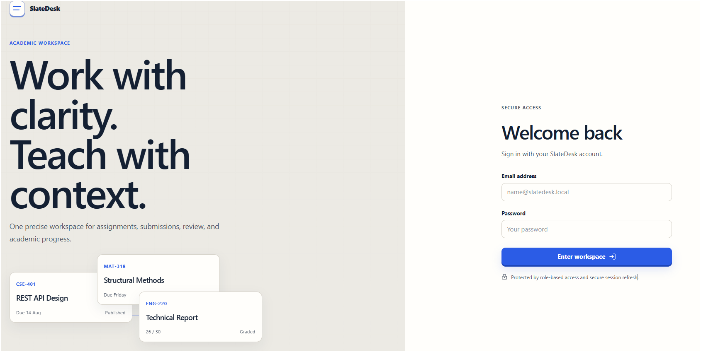
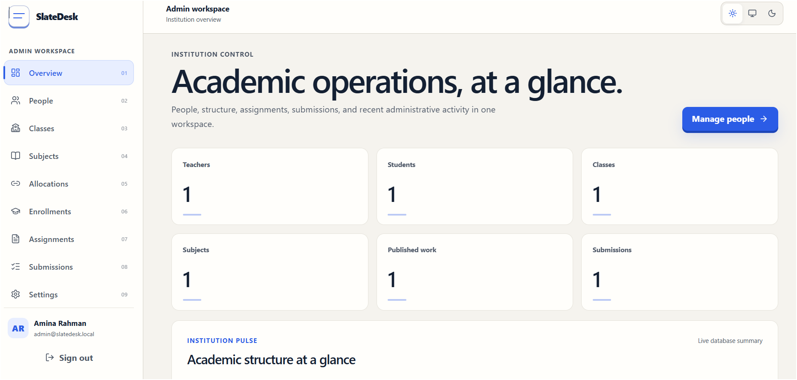
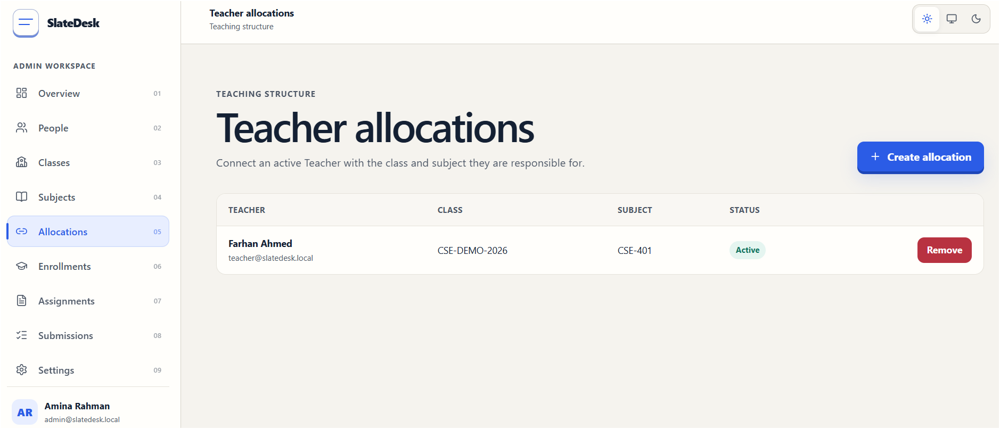
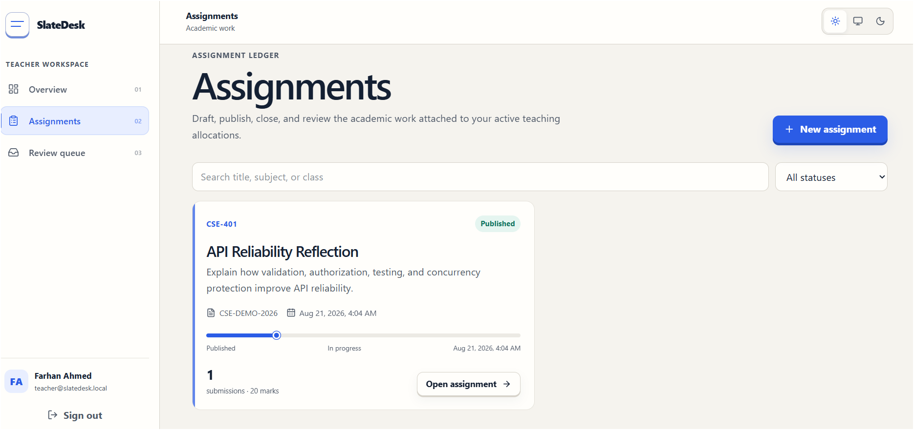
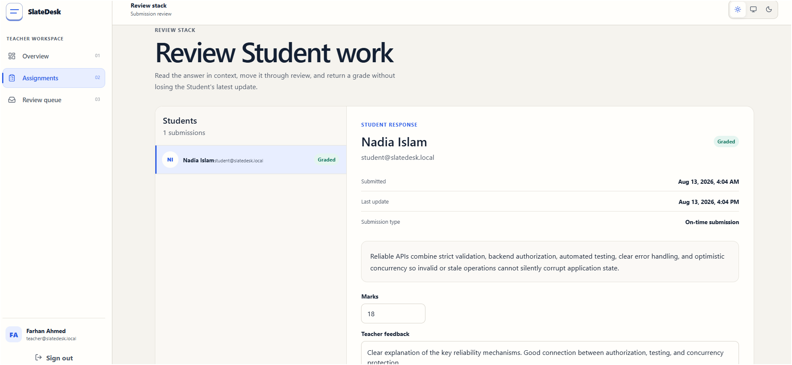
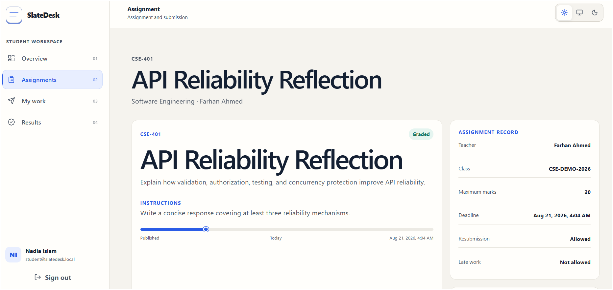
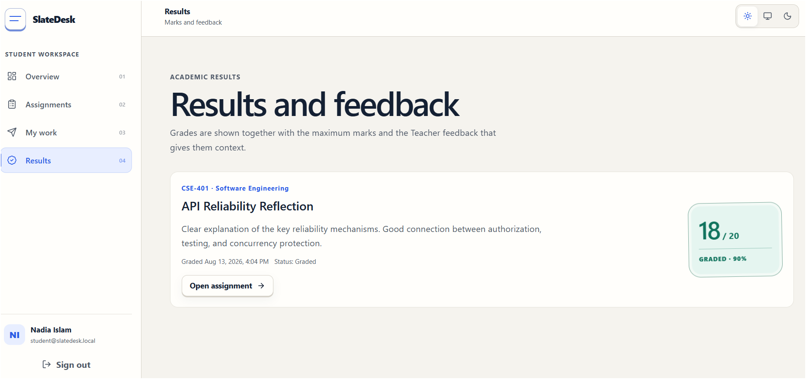
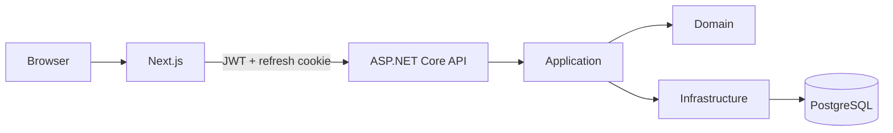

# SlateDesk

**Academic work, clearly organized.**

SlateDesk is a full-stack assignment and submission management system built for a recruitment engineering project.

It provides role-specific academic workspaces for Administrators, Teachers, and Students while keeping authorization and business rules authoritative in the backend.



---

## Features

### Admin

- manage Teacher and Student accounts;
- manage classes and subjects;
- allocate Teachers to class/subject combinations;
- enroll Students;
- view all assignments;
- view all submissions;
- manage application settings;
- inspect recent administrative activity.

### Teacher

- create Draft assignments;
- edit assignments;
- publish and close assignments;
- archive assignments when appropriate;
- review Student submissions;
- move work through review states;
- add marks and feedback;
- update grades safely with optimistic concurrency.

### Student

- view relevant published assignments;
- inspect assignment details and deadlines;
- save Draft answers;
- submit work;
- resubmit when allowed;
- view submission status;
- view marks and Teacher feedback;
- recover safely from stale-update conflicts.

---

## Screenshots

### Admin





### Teacher





### Student





---

## Technology

### Frontend

- Next.js
- React
- TypeScript
- TanStack Query
- React Hook Form
- Zod
- Lucide
- Recharts
- custom responsive SlateDesk design system

### Backend

- ASP.NET Core Web API
- C#
- Entity Framework Core
- ASP.NET Core Identity
- JWT authentication
- HttpOnly refresh cookies
- Swagger / OpenAPI
- RFC-compatible Problem Details
- BackgroundService workers

### Database

- PostgreSQL
- EF Core migrations
- explicit indexes
- readable string-backed enums
- global query filters
- PostgreSQL `xmin` optimistic concurrency

### Testing

- xUnit
- EF Core InMemory for isolated business-rule tests
- targeted authentication, deadline, ownership, grading, query-filter, concurrency and replay tests

---

## Architecture

SlateDesk is a modular monolith.



Backend projects:

```text
SlateDesk.Domain
SlateDesk.Application
SlateDesk.Infrastructure
SlateDesk.Api
```

More detail:

- [Architecture documentation](docs/architecture.md)

---

# Quick Start — Docker

## Requirements

Install:

- Git
- Docker Desktop

## 1. Clone

```powershell
git clone YOUR_REPOSITORY_URL
cd SlateDesk
```

## 2. Create environment file

PowerShell:

```powershell
Copy-Item .env.example .env
```

macOS/Linux:

```text
cp .env.example .env
```

Open `.env` and replace:

```text
POSTGRES_PASSWORD
JWT_SIGNING_KEY
```

`JWT_SIGNING_KEY` must contain at least 32 bytes of unpredictable data.

The supplied `DEMO_PASSWORD` is intentionally a public demo credential, not a production secret.

## 3. Start SlateDesk

```powershell
docker compose up --build -d
```

## 4. Open

Frontend:

```text
http://localhost:3000
```

Swagger:

```text
http://localhost:8080/swagger
```

Health:

```text
http://localhost:8080/api/v1/health
```

## 5. Stop

```powershell
docker compose down
```

To also remove the Docker demo database:

```powershell
docker compose down -v
```

---

# Demo Accounts

All demo accounts use:

```text
Password: SlateDeskDemo#2026
```

| Role | Email | Password |
|---|---|---|
| Admin | `admin@slatedesk.local` | `SlateDeskDemo#2026` |
| Teacher | `teacher@slatedesk.local` | `SlateDeskDemo#2026` |
| Student | `student@slatedesk.local` | `SlateDeskDemo#2026` |

These credentials exist only for evaluator/demo use.

---

# Demo Data

When demo seeding is enabled, SlateDesk creates idempotent sample data including:

- the three demo users;
- academic class;
- Software Engineering subject;
- Teacher allocation;
- Student enrollment;
- published assignment;
- graded Student submission;
- application settings.

The evaluator does not need to create application tables manually.

---

# Local Development Without Docker

## Requirements

Install:

- .NET 10 SDK
- Node.js
- npm
- PostgreSQL
- Git

## PostgreSQL

Create a PostgreSQL database and application user.

Example database:

```text
slatedesk_dev
```

Example application user:

```text
slatedesk_app
```

Do not use a PostgreSQL administrator account as the application's runtime identity.

---

## Backend configuration

Enter:

```text
cd backend
```

Restore local tools:

```powershell
dotnet tool restore
```

Store secrets using .NET User Secrets:

```powershell
dotnet user-secrets set "ConnectionStrings:DefaultConnection" "Host=localhost;Port=5432;Database=slatedesk_dev;Username=slatedesk_app;Password=YOUR_DATABASE_PASSWORD" --project src\SlateDesk.Api

dotnet user-secrets set "Jwt:SigningKey" "YOUR_RANDOM_SIGNING_KEY_AT_LEAST_32_BYTES" --project src\SlateDesk.Api
```

Enable demo accounts:

```powershell
dotnet user-secrets set "DemoAccounts:SeedEnabled" "true" --project src\SlateDesk.Api

dotnet user-secrets set "DemoAccounts:Password" "SlateDeskDemo#2026" --project src\SlateDesk.Api
```

Trust the ASP.NET development certificate:

```powershell
dotnet dev-certs https --trust
```

Run:

```powershell
dotnet run --project src\SlateDesk.Api\SlateDesk.Api.csproj --launch-profile https
```

The application applies EF Core migrations during startup and then executes the idempotent demo seed.

API:

```text
https://localhost:7049
```

Swagger:

```text
https://localhost:7049/swagger
```

---

## Frontend configuration

Open another terminal:

```text
cd apps\web
```

Create local environment configuration:

```powershell
Copy-Item .env.example .env.local
```

The default is:

```dotenv
NEXT_PUBLIC_API_URL=https://localhost:7049
```

Install:

```powershell
npm ci
```

Run:

```powershell
npm run dev
```

Open:

```text
http://localhost:3000
```

---

# Database Migrations

Migrations are stored in the repository.

The API applies pending migrations automatically during demo/development startup.

They can also be applied manually:

```text
cd backend

dotnet tool restore

dotnet tool run dotnet-ef database update --project src\SlateDesk.Infrastructure\SlateDesk.Infrastructure.csproj --startup-project src\SlateDesk.Api\SlateDesk.Api.csproj
```

Production systems with multiple application instances should normally execute migrations as a controlled deployment step rather than having every instance race to migrate the database.

---

# Testing

Backend:

```text
cd backend

dotnet format
dotnet build
dotnet test
```

Check the EF model:

```powershell
dotnet tool run dotnet-ef migrations has-pending-model-changes --project src\SlateDesk.Infrastructure\SlateDesk.Infrastructure.csproj --startup-project src\SlateDesk.Api\SlateDesk.Api.csproj
```

Frontend:

```text
cd apps\web

npm ci
npm run check:contrast
npm run build
npx eslint .
```

---

# Authentication & Security

SlateDesk implements:

- ASP.NET Core Identity password hashing;
- short-lived JWT access tokens;
- HttpOnly refresh cookies;
- SHA-256 refresh-token hashes;
- refresh-token rotation;
- token-family replay detection;
- family revocation after replay;
- backend-enforced role authorization;
- backend-enforced ownership rules;
- disabled-user validation;
- generic login failure responses;
- login lockout;
- RFC-compatible Problem Details;
- `X-Content-Type-Options`;
- `X-Frame-Options`;
- restrictive referrer policy.

Real signing keys and database passwords are never committed.

The HTTP cookie override in `docker-compose.yml` exists only for the local Docker demonstration environment. Production deployments must use HTTPS and secure cookies.

---

# Authorization

Backend authorization is authoritative.

Examples:

- Students cannot access Admin APIs;
- Teachers can modify only their own assignments;
- Teachers can grade only submissions belonging to their assignments;
- Students see only assignments belonging to their active class;
- Students can modify only their own submission;
- frontend route guards are UX only.

---

# Deadline Enforcement

SlateDesk includes a background worker that synchronizes expired Published assignments to Closed.

The worker is not the security boundary.

Every Student submission request independently evaluates:

```text
DeadlineUtc
AllowLateSubmission
AllowResubmission
Assignment status
```

against the current UTC time.

This keeps deadline behavior correct even before the background worker runs.

---

# Optimistic Concurrency

Student submission and Teacher grading updates include a version value.

PostgreSQL's hidden:

```text
xmin
```

column is mapped through EF Core as a row version.

If another request changed the submission first, SlateDesk returns:

```text
409 Conflict
```

The frontend offers:

```text
Reload latest data
```

instead of silently overwriting the newer state.

---

# API Versioning

All application routes use:

```text
/api/v1
```

A dedicated versioning package is intentionally not used because the recruitment project exposes only one API version.

The explicit route prefix preserves a future path to `/api/v2` without unnecessary current complexity.

See:

- [API overview](docs/api-overview.md)

---

# Accessibility

SlateDesk targets WCAG 2.2 AA.

Implemented accessibility work includes:

- semantic landmarks;
- skip link;
- visible keyboard focus;
- keyboard navigation;
- accessible labels;
- status text rather than color-only meaning;
- Dialog and Drawer focus traps;
- Escape-to-close behavior;
- focus restoration;
- reduced-motion support;
- normal-text contrast verification;
- responsive touch targets;
- accessible chart summaries.

Run:

```powershell
npm run check:contrast
```

to verify the tracked color-pair checks.

---

# Theme

SlateDesk supports:

```text
Light
Dark
System
```

Light is the primary visual presentation.

The UI uses semantic tokens instead of color inversion, so controls, status surfaces, charts and grading elements remain intentionally designed in both themes.

---

# Design Direction

SlateDesk uses an editorial academic SaaS visual language.

Signature elements include:

- Academic Ledger Motif;
- Deadline Rail;
- Assignment Ledger Card;
- Review Stack;
- Student Folio;
- Grade Seal;
- Activity Thread.

The design intentionally avoids:

- generic dashboard templates;
- glassmorphism;
- neon borders;
- decorative blobs;
- excessive gradients;
- theatrical motion.

---

# Production Hardening Decisions

Already implemented:

- backend role authorization;
- ownership enforcement;
- short JWT lifetime;
- refresh-token replay protection;
- HTTPS-oriented secure cookie defaults;
- password lockout;
- health checks;
- structured errors;
- security headers;
- UTC deadlines;
- optimistic concurrency;
- database indexes;
- query filters;
- no lazy loading;
- DTO projection;
- no real secrets in Git.

For a real production deployment beyond this recruitment project, the next steps would include:

- managed PostgreSQL;
- TLS termination;
- secret manager;
- centralized structured logs;
- application monitoring;
- automated backups;
- rate limiting;
- controlled migration jobs;
- production CI/CD.

---

# Project Structure

```text
SlateDesk/
├── apps/
│   └── web/
├── backend/
│   ├── src/
│   │   ├── SlateDesk.Api/
│   │   ├── SlateDesk.Application/
│   │   ├── SlateDesk.Domain/
│   │   └── SlateDesk.Infrastructure/
│   └── tests/
├── docs/
│   ├── architecture.md
│   ├── api-overview.md
│   ├── database-schema.md
│   └── screenshots/
├── .env.example
├── docker-compose.yml
└── README.md
```

---

# Additional Documentation

- [Architecture](docs/architecture.md)
- [API overview](docs/api-overview.md)
- [Database schema](docs/database-schema.md)

---

# Scope

SlateDesk intentionally does not implement:

- real-time chat;
- payments;
- video classes;
- file-storage infrastructure;
- microservices;
- event brokers;
- mobile applications.

The project prioritizes complete academic workflows, security, correctness, maintainability, accessibility, and evaluator-friendly setup.