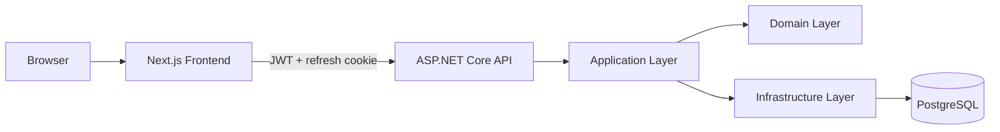

# SlateDesk Architecture

SlateDesk is implemented as a modular monolith.

## System overview

## Backend projects

### SlateDesk.Domain

Contains:

- domain entities;
- enums;
- role constants;
- core academic concepts.

### SlateDesk.Application

Contains:

- DTOs;
- request models;
- service interfaces;
- application contracts;
- business-use-case abstractions.

### SlateDesk.Infrastructure

Contains:

- Entity Framework Core;
- PostgreSQL persistence;
- ASP.NET Core Identity;
- JWT and refresh-token services;
- Admin services;
- assignment services;
- submission/grading services;
- background workers;
- database seed logic.

### SlateDesk.Api

Contains:

- REST controllers;
- authentication/authorization;
- Problem Details;
- Swagger/OpenAPI;
- CORS;
- HTTP security headers;
- health checks.

## Frontend

The frontend uses:

- Next.js App Router;
- React;
- TypeScript;
- TanStack Query;
- React Hook Form;
- Zod;
- Lucide;
- Recharts;
- custom SlateDesk UI primitives.

Role-specific workspaces are provided for:

- Admin;
- Teacher;
- Student.

## Authorization model

The backend is authoritative.

Frontend route guards improve user experience but never replace API authorization.

The API verifies:

- role;
- resource ownership;
- Teacher allocations;
- Student enrollment;
- assignment visibility;
- submission ownership.

## Authentication

SlateDesk uses:

- short-lived JWT access tokens;
- HttpOnly refresh cookies;
- hashed refresh tokens in PostgreSQL;
- token-family rotation;
- replay detection;
- family revocation after replay.

## Deadline correctness

The automatic assignment worker synchronizes workflow status every five minutes.

Submission commands independently evaluate the actual UTC deadline, so correctness does not depend on the background worker.

## Concurrency

Submission and grading updates use PostgreSQL `xmin`.

The API returns `409 Conflict` when a stale version attempts to overwrite newer work.

## Data access

Read-heavy endpoints use:

- `AsNoTracking()`;
- projection directly into DTOs;
- server-side filtering;
- server-side sorting;
- server-side pagination.

Lazy loading is not used.

## Deployment

The repository includes:

- frontend Dockerfile;
- API Dockerfile;
- PostgreSQL Docker service;
- Docker Compose;
- environment templates.

The production deployment should terminate TLS before the application and keep secure refresh cookies enabled.